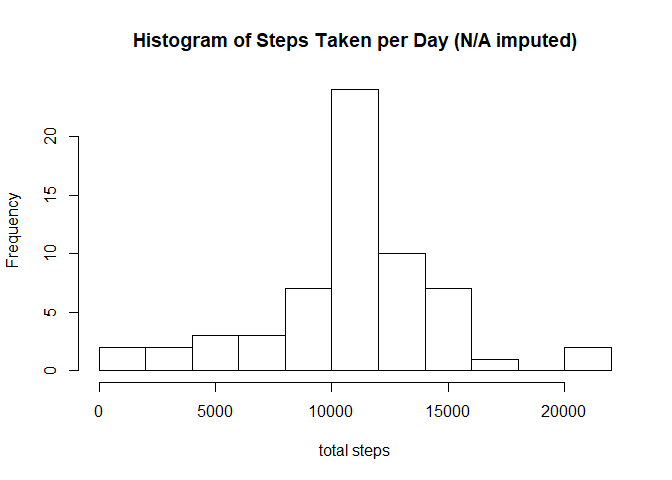

## Loading and preprocessing the data

The first step is loading and pre-processing the data.


```r
unzip("activity.zip")

library(readr)
activity <- read_csv(
  "activity.csv",
  col_types = cols(
    date = col_date(format = "%Y-%m-%d"),
    interval = col_integer(),
    steps = col_integer()
  )
)
```

As the repository already contains the data file, it's not necessary to download it, but it's zipped, so we first unzip it, and then use the `read_csv` function to load it into the session.


```r
activity_cc <- activity[complete.cases(activity),]
```

A dataframe with only the complete cases will be useful to answer some of the questions.

Finally, is also generally handy to have the `dplyr` and `ggplot2` packages loaded.


```r
library(dplyr)
library(ggplot2)
```

## What is mean total number of steps taken per day?

To have a better understanding of the tutal number of steps taken per day, we first group the observations by date and sum the steps in each group.


```r
steps_by_date <- activity_cc %>%
  group_by(date) %>%
  summarise(steps = sum(steps))
```

Then, the `summary` function can quickly give us some metrics on the resulting `steps` variable, like its mean and median.


```r
summary(steps_by_date$steps)
```

```
##    Min. 1st Qu.  Median    Mean 3rd Qu.    Max. 
##      41    8841   10765   10766   13294   21194
```

And a histogram can help us visualize it further.


```r
hist(
  steps_by_date$steps,
  breaks = 10,
  main = "Histogram of Steps Taken per Day",
  xlab = "total steps"
)
```

<!-- -->

So, we see that the it was most frequent to take a little over ten thousand steps in a day.

## What is the average daily activity pattern?


```r
interval_means <- activity_cc %>%
  group_by(interval) %>%
  summarise(steps = mean(steps))

ggplot(data = interval_means, aes(x = interval, y = steps)) +
  geom_line()
```

<!-- -->

## Imputing missing values


```r
activity_na_imputed <-
  activity %>%
  inner_join(interval_means, by = "interval") %>%
  transmute(date, interval, steps = if_else(is.na(steps.x), steps.y, as.numeric(steps.x)))

steps_by_date_na_imputed <- activity_na_imputed %>%
  group_by(date) %>%
  summarise(steps = sum(steps))

summary(steps_by_date_na_imputed$steps)
```

```
##    Min. 1st Qu.  Median    Mean 3rd Qu.    Max. 
##      41    9819   10766   10766   12811   21194
```

```r
hist(
  steps_by_date_na_imputed$steps,
  breaks = 10,
  main = "Histogram of Steps Taken per Day (N/A imputed)",
  xlab = "total steps"
)
```

<!-- -->

## Are there differences in activity patterns between weekdays and weekends?


```r
interval_means_weekday <-
  activity_na_imputed %>%
  mutate(weekday = weekdays(date)) %>%
  transmute(interval, steps, weekday = as.factor(
    if_else(weekday == "Saturday" | weekday == "Sunday",
            "weekend",
            "weekday")
  )) %>%
  group_by(interval,weekday) %>%
  summarise(steps = mean(steps))

ggplot(data = interval_means_weekday, aes(x = interval, y = steps, colour = weekday)) +
  geom_line()+
  facet_grid(vars(weekday))
```

<!-- -->
